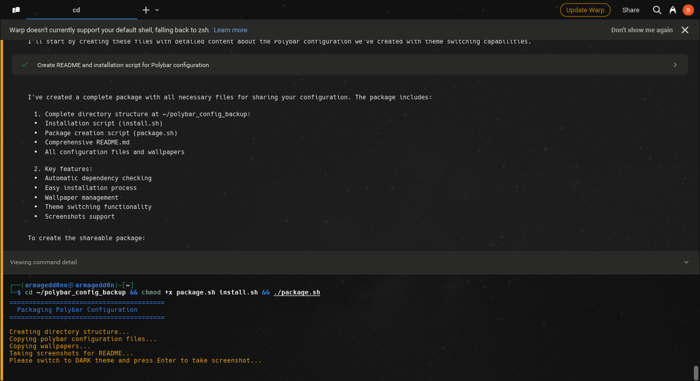
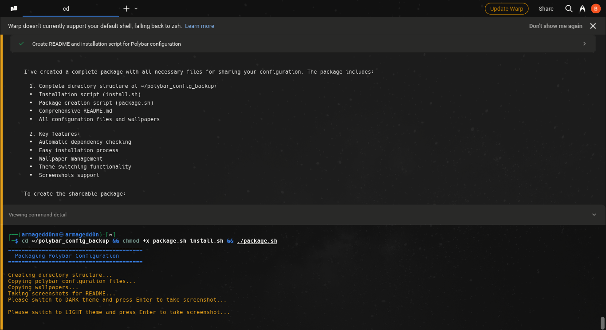

# Goth Themed Polybar Configuration

A customizable Polybar configuration with dynamic theme switching between light and dark modes. The setup includes a small theme toggle button that changes both the polybar appearance and wallpaper with a single click.

 

## Features

- **Theme Toggle:** Click a small button to switch between light and dark themes
- **Dynamic Wallpapers:** Randomly selects from your collections of light and dark wallpapers
- **Aesthetic Wallpaper Styling:** Displays wallpapers at 30% of screen size centered on a solid background
- **Essential Modules:** i3 workspaces, date/time, volume, network, battery status
- **Clean & Minimal Design:** Based on the classic i3wm aesthetic

## Dependencies

The following packages are required:

```bash
# Core components
polybar          # The bar itself
feh              # Wallpaper handling
imagemagick      # Image processing for wallpapers

# Font dependencies
fonts-font-awesome  # Icon font for module symbols

# Optional dependencies
pavucontrol      # For volume control
nm-connection-editor  # For network management
```

## Installation

### Automatic Installation

1. Run the installation script:

```bash
cd ~/polybar_config_backup
chmod +x install.sh
./install.sh
```

### Manual Installation

1. Create necessary directories:

```bash
mkdir -p ~/.config/polybar/scripts
mkdir -p ~/black_goth ~/white_goth
```

2. Copy configuration files:

```bash
cp .config/polybar/config.ini ~/.config/polybar/
cp .config/polybar/scripts/* ~/.config/polybar/scripts/
chmod +x ~/.config/polybar/scripts/*.sh
```

3. Copy wallpapers:

```bash
cp -r wallpapers/black_goth/* ~/black_goth/
cp -r wallpapers/white_goth/* ~/white_goth/
```

4. Add to your i3 config (~/.config/i3/config):

```
# Start polybar
exec_always --no-startup-id ~/.config/polybar/scripts/launch.sh
```

## Configuration

### Wallpaper Management

The system expects wallpapers in two directories:
- `~/white_goth/` - Wallpapers for light theme
- `~/black_goth/` - Wallpapers for dark theme

Add your own wallpapers to these directories to customize your experience.

### Polybar Modules

The configuration includes the following modules:
- **i3:** Workspaces with highlighting for active workspace
- **Date/Time:** Current date and time
- **Volume:** Audio volume with click control
- **Battery:** Battery percentage and charging status
- **Network:** WiFi/Ethernet connection status
- **System Tray:** For system tray icons
- **Theme Toggle:** Small button to switch themes

### Customization

To modify the appearance:
- Edit `~/.config/polybar/config.ini` for colors, sizes, and module options
- Adjust theme colors in the `[colors]` section
- Modify module positioning in the `modules-left`, `modules-center`, and `modules-right` properties

## Usage

### Theme Switching

Click the small circle button (⚪) on the far right of the polybar to toggle between:
- **Light Theme:** White polybar with black text and a light wallpaper
- **Dark Theme:** Black polybar with white text and a dark wallpaper

The theme switcher:
1. Changes polybar colors
2. Randomly selects a new wallpaper from the appropriate collection
3. Crops the wallpaper borders (3px)
4. Resizes it to 30% of your screen size
5. Centers it on a solid white or black background

### Keyboard Shortcuts

The standard i3 keyboard shortcuts apply to workspaces and applications.

## Troubleshooting

- **Missing Icons:** Make sure font-awesome is installed
- **Theme Not Switching:** Check permissions on theme-switch.sh and launch.sh scripts
- **Wallpaper Not Changing:** Ensure your wallpaper directories contain valid image files

## Credits

This configuration was created by [Your Name]. Feel free to modify and share!

